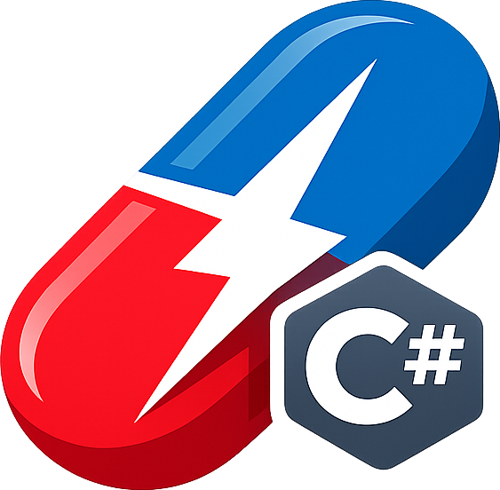
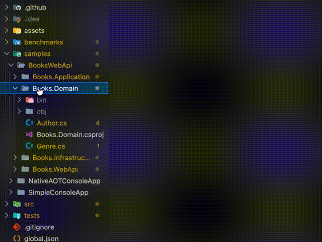
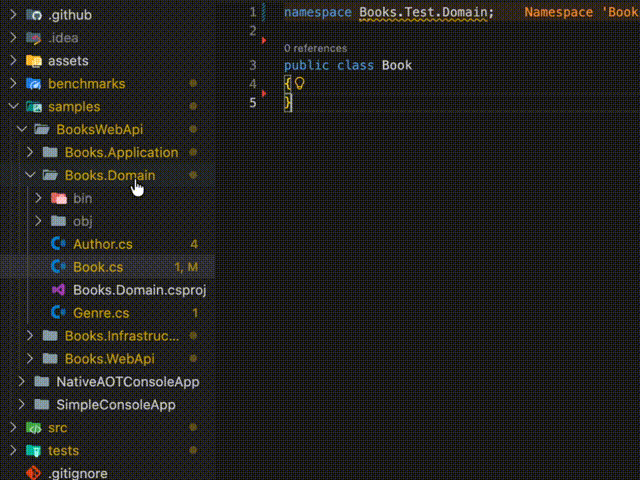
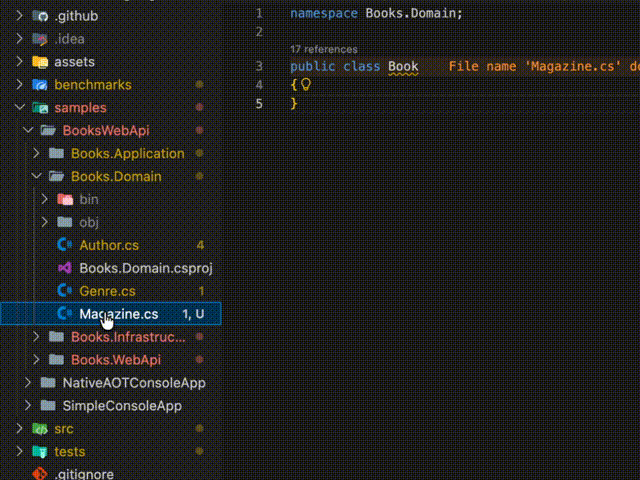
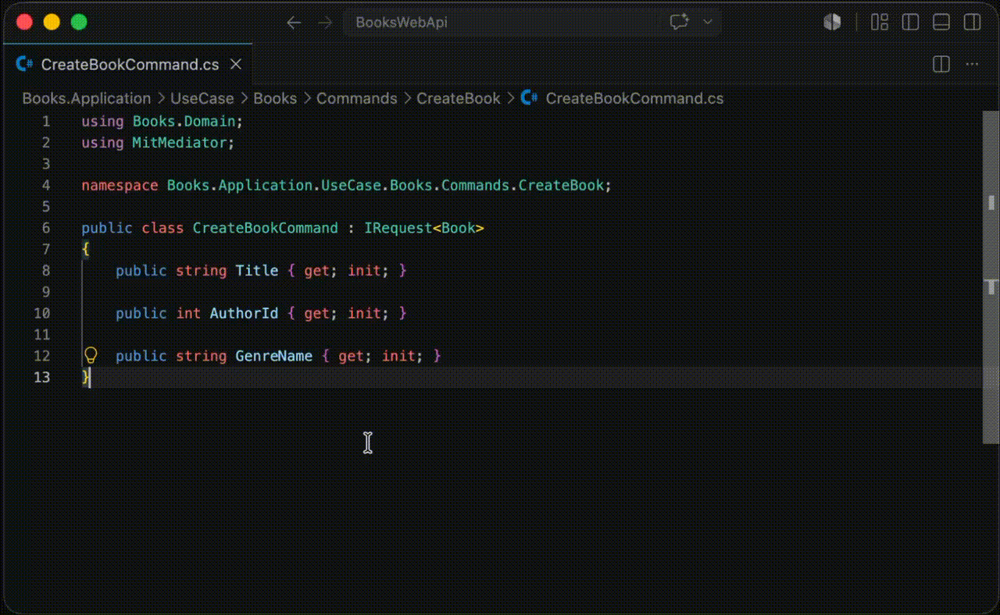
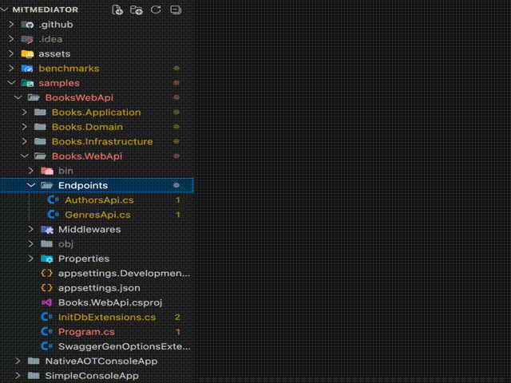
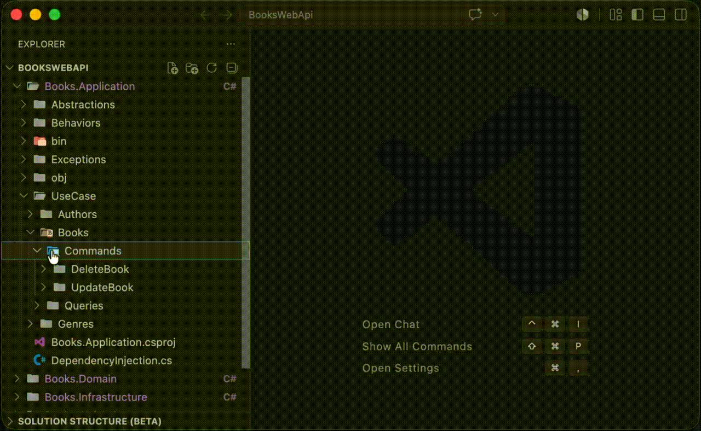
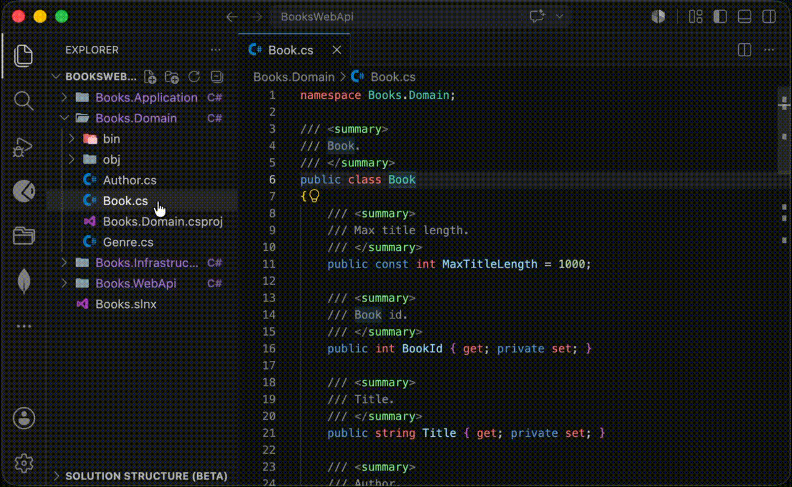
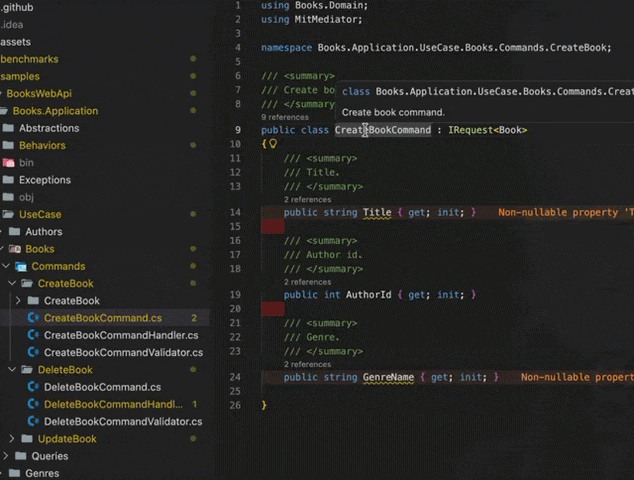

# CSharp Painkiller

Smart file creation, namespace management, code generation, diagnostics, and more for C#.

[GitHub repository](https://github.com/dzmprt/CSharpPainkiller)

---

## Table of Contents

- [Features](#features)
  - [Create C# Types](#create-c-types)
  - [Adjust Namespaces](#adjust-namespaces)
  - [Rename File By Type](#rename-file-by-type)
  - [Generate Mapping Methods](#generate-mapping-methods)
  - [Sort Usings](#sort-usings)
  - [Extract Interface](#extract-interface)
  - [ASP.NET Templates](#aspnet-templates)
  - [MediatR and MitMediator templates](#mediatr-and-mitmediator-templates)
  - [EF Core](#ef-core)
  - [Diagnostics](#diagnostics)
  - [Go To Handler](#go-to-handler)
- [Issues](#issues)
- [Release Notes](#release-notes)

## Features

### Create C# Types

Quickly scaffold new C# type files with auto-detected namespaces. Right-click a **folder** in the Explorer → **C# Create**.

### Adjust Namespaces

Fix namespace declarations across one file or an entire folder in a single action. Right-click any `.cs` file or folder → **C# Refactor → C# Adjust Namespaces**.

### Rename File By Type

Rename `.cs` files to match the C# type they contain. Right-click a file or folder → **C# Refactor → C# Rename File By Type**.

### Generate Mapping Methods

Generate `MapTo` / `MapFrom` boilerplate for mapping between types. Available in the **C# Refactor** submenu.

### Sort Usings

Alphabetically sort `using` directives in a `.cs` file or across an entire folder. Right-click → **C# Refactor → C# Sort Usings**.

### Extract Interface

Generate an interface from a class definition in one click. Right-click a `.cs` file → **C# Refactor → C# Extract Interface**.

### ASP.NET Templates

Scaffold ASP.NET controllers and Minimal API endpoints. Right-click a folder → **C# Generator → ASP.NET**.

| Template | Description |
|----------|-------------|
| **Empty Controller** | Bare-bones `[ApiController]` class |
| **EF CRUD Controller** | Full CRUD controller wired to `DbContext` |
| **Empty Minimal API** | Minimal API endpoint group stub |
| **EF CRUD Minimal API** | Full CRUD Minimal API wired to `DbContext` |

### MediatR and MitMediator templates

Generate requests, handlers, notifications, and pipeline behaviors. Right-click a folder → **C# Generator → MediatR/MitMediator**. It is not necessary to enter the full name of the request, if it is a base request like "get, create, delete, update or other" the extension will automatically substitute the name and determine whether it is a command or a query.

| Template | Description |
|----------|-------------|
| **Request and Handler** | `IRequest` + `IRequestHandler` pair |
| **Request** | `IRequest` only |
| **RequestHandler** | `IRequestHandler` only |
| **Notification and Handler** | `INotification` + `INotificationHandler` pair |
| **Notification** | `INotification` only |
| **NotificationHandler** | `INotificationHandler` only |
| **Empty PipelineBehavior** | Blank `IPipelineBehavior` |
| **FluentValidation PipelineBehavior** | Validation behavior using FluentValidation |

### EF Core

Scaffold Entity Framework Core entity configurations. Right-click a folder → **C# Generator → EF Core**, or right-click a `.cs` entity file directly.

### Diagnostics

The extension provides real-time inline diagnostics for common C# code-quality issues. All diagnostics can be individually enabled or disabled in Settings.

| Diagnostic | Description | Setting |
|-----------|-------------|---------|
| **Wrong namespace** | Namespace doesn't match the file path | `csharppainkiller.diagnostics.wrongNamespace` |
| **Wrong filename** | File name doesn't match the primary type name | `csharppainkiller.diagnostics.wrongFilename` |
| **Unsorted usings** | `using` directives are not in alphabetical order | `csharppainkiller.diagnostics.unsortedUsings` |
| **Mixed-language identifiers** | Type/method/variable names contain non-Latin or mixed-script characters | `csharppainkiller.diagnostics.mixedLanguageIdentifiers` |

### Go To Handler

Navigate between a MediatR/MitMediator request file and its handler.

## Issues

- If you find a bug please report it on [GitHub issues](https://github.com/dzmprt/CSharpPainkiller/issues)

## Release Notes

### 0.0.1

Initial release with:
- C# type creation (class, record, struct, enum, interface, record struct)
- Namespace adjustment for files and folders with automatic `using` directive updates
- File renaming based on the contained C# type name
- Sort usings, extract interface, generate mapping methods
- ASP.NET, MediatR, MitMediator, and EF Core code generation templates
- Real-time diagnostics (wrong namespace, wrong filename, unsorted usings, mixed-language identifiers)
- Generate Request and handler for MediatR and MitMediator request files
- Go To Handler for MediatR and MitMediator
