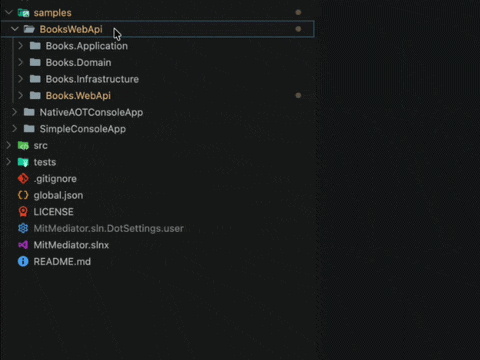

C# Painkiller

Smart file creation, code generation, project creation, namespace management and more for C#.

[GitHub repository](https://github.com/dzmprt/CSharpPainkiller)

[VisualStudio Marketplace](https://marketplace.visualstudio.com/items?itemName=DzmitryPratsko.csharppainkiller)

---

## Requirements

- **VS Code 1.92.0+**

## Table of Contents

- [Features](#features)
  - [Create C# Types](#create-c-types)
  - [Adjust Namespaces](#adjust-namespaces)
  - [Rename File By Type](#rename-file-by-type)
  - [Generate Mapping Methods](#generate-mapping-methods)
  - [Generate DTO](#generate-dto)
  - [Generate FluentValidation Validator](#generate-fluentvalidation-validator)
  - [Extract Type to File](#extract-type-to-file)
  - [Sort Usings](#sort-usings)
  - [Extract Interface](#extract-interface)
  - [.NET Project Creation](#net-project-creation)
  - [ASP.NET Templates](#aspnet-templates)
  - [MediatR and MitMediator templates](#mediatr-and-mitmediator-templates)
  - [EF Core Configuration](#ef-core-configuration)
  - [Entity Framework CMD](#ef-core-cmd)
  - [Go To Handler](#go-to-handler)
  - [Color for projects](#color-for-projects)
- [Issues](#issues)
- [Release Notes](#release-notes)

## Features

### Create C# Types

Quickly scaffold new C# type files with auto-detected namespaces. Right-click a **folder** in the Explorer → **C# Create**.

### Adjust Namespaces

Fix namespace declarations across one file or an entire folder in a single action. Right-click any `.cs` file or folder → **C# Refactor → C# Adjust Namespaces**.

### Rename File By Type

Rename `.cs` files to match the C# type they contain. Right-click a file or folder → **C# Refactor → C# Rename File By Type**.

### Generate Mapping Methods

Generate static `MapTo{TargetType}` / `MapFrom{TargetType}` methods for mapping between types. Place the cursor on a type name and use the lightbulb (**Quick Fix** / **Refactor**) code actions:

- **Generate MapTo method**
- **Generate MapFrom method**

The extension prompts for the target type, maps matching public properties, and inserts the method at the end of the source type.

### Generate DTO

Scaffold a DTO class with matching public properties and a static `MapFrom{SourceType}` factory method inside the DTO.

- **Explorer** — right-click a `.cs` file → **Generate DTO with MapFrom**
- **Editor** — place the cursor on a type name → lightbulb → **Generate DTO with MapFrom in DTO**

The DTO file is created next to the source file. You can customize the DTO name in the input prompt.

### Generate FluentValidation Validator

Generate a FluentValidation `AbstractValidator<T>` for a class, record, or struct based on its public properties. Rules are inferred from property types (strings, numbers, dates, enums, collections, and more).

- **Explorer** — right-click a `.cs` file → **Generate FluentValidation Validator**
- **Editor** — place the cursor on a type name → lightbulb → **Generate FluentValidation validator**

The validator file (`{TypeName}Validator.cs`) is created next to the source file.

### Extract Type to File

Move a type from a multi-type file into its own `{TypeName}.cs` file. Place the cursor on the type name and choose the lightbulb quick fix **Extract '{TypeName}' to file**.

Supported types: class, struct, record, record struct, enum, and interface. Partial types cannot be extracted. The new file keeps relevant `using` directives, namespace, and XML documentation from the source file.

### Sort Usings

Alphabetically sort `using` directives in a `.cs` file or across an entire folder. Right-click → **C# Refactor → C# Sort Usings**.

### Extract Interface

Generate an interface from a class definition in one click. Right-click a `.cs` file → **C# Refactor → C# Extract Interface**.

### .NET Project Creation

Scaffold new .NET projects using dynamic templates from `dotnet new list`. Right-click a **folder** in the Explorer → **.NET NEW**. The extension dynamically fetches available .NET templates and registers them as commands at startup, allowing you to create any project type supported by the .NET SDK.

### ASP.NET Templates

Scaffold ASP.NET controllers and Minimal API endpoints. Right-click a folder → **C# Generator → ASP.NET**.

| Template | Description |
|----------|-------------|
| **Empty Controller** | Bare-bones `[ApiController]` class |
| **EF CRUD Controller** | Full CRUD controller wired to `DbContext` |
| **Empty Minimal API** | Minimal API endpoint group stub |
| **EF CRUD Minimal API** | Full CRUD Minimal API wired to `DbContext` |

### MediatR and MitMediator templates

Generate requests, handlers, notifications, and pipeline behaviors. Right-click a folder → **C# Generator → MediatR/MitMediator**. It is not necessary to enter the full name of the request, if it is a base request like "get, create, delete, update or other" the extension will automatically substitute the name and determine whether it is a command or a query.

| Template | Description |
|----------|-------------|
| **Request and Handler** | `IRequest` + `IRequestHandler` pair |
| **Request** | `IRequest` only |
| **RequestHandler** | `IRequestHandler` only |
| **Notification and Handler** | `INotification` + `INotificationHandler` pair |
| **Notification** | `INotification` only |
| **NotificationHandler** | `INotificationHandler` only |
| **Empty PipelineBehavior** | Blank `IPipelineBehavior` |
| **FluentValidation PipelineBehavior** | Validation behavior using FluentValidation |

### EF Core Configuration

Scaffold Entity Framework Core entity configurations. Right-click a folder → **C# Generator → EF Core**, or right-click a `.cs` entity file directly.

### Entity Framework CMD

Run Entity Framework Core migration commands directly from the Explorer context menu on a `.csproj` file:

| Command | Description |
|---------|-------------|
| **Add Migration** | Add a new EF Core migration |
| **Remove Migration** | Remove the last migration |
| **Update Database** | Update the database to the latest migration |
| **List Migrations** | List all available migrations |
| **Script Migration** | Generate a SQL script for migrations |

### Go To Handler

Navigate between a MediatR/MitMediator request or notification file and its handler. Right-click a mediator `.cs` file in the Explorer:

- **Go To Handler** — open the matching handler file
- **Generate Handler** — create a handler if one does not exist yet

Code actions in the editor offer the same navigation when the cursor is on a request or notification type.

### Color for projects

The names of the folders containing project files are highlighted in purple.

## Issues

- If you find a bug please report it on [GitHub issues](https://github.com/dzmprt/CSharpPainkiller/issues)

## Release Notes

### 0.0.4

- Added **Generate DTO with MapFrom** — creates a DTO file with properties and a static `MapFrom{SourceType}` method
- Added **Generate FluentValidation Validator** — scaffolds `AbstractValidator<T>` with type-aware rules
- Added **Extract Type to File** — quick fix code action to move a type from a multi-type file into its own file
- Improved **MapTo / MapFrom** generation — methods are now `static` with type-specific names (`MapToTarget`, `MapFromTarget`), code actions work on the type under the cursor
- Fixed **Adjust Namespaces** — `using` directives are updated only when a file actually references moved types
- Fixed **Extract Interface** menu — shown only for `.cs` files, not folders
- Fixed **Go To Handler / Generate Handler** — nested generic return types (e.g. `IRequest<List<Author>>`) are parsed correctly
- Fixed **MitMediator Handler** generation for void requests — `IRequestHandler<TRequest>` with `ValueTask<Unit> HandleAsync(...)`
- Fixed type parsing for **Rename File By Type** — `record struct`, block-scoped namespaces with nested braces, and ambiguous multi-type files

### 0.0.3

- Added **Entity Framework CMD** commands — Add Migration, Remove Migration, Update Database, List Migrations, Script Migration via `dotnet ef` CLI. Added **Entity Framework CMD** submenu to `.csproj` file context menu
- Custom color for C# project folders

### 0.0.2

- Added **.NET Project Creation** (`.NET NEW`) — dynamic template scaffolding from `dotnet new list`
- Real-time diagnostics have been removed due to performance issues. This may be added in the future
- Changed sort usings logic

### 0.0.1

Initial release with:
- C# type creation (class, record, struct, enum, interface, record struct)
- Namespace adjustment for files and folders with automatic `using` directive updates
- File renaming based on the contained C# type name
- Sort usings, extract interface, generate MapTo/MapFrom mapping methods
- ASP.NET templates (Empty Controller, EF CRUD Controller, Empty Minimal API, EF CRUD Minimal API)
- MediatR and MitMediator templates (Request, Handler, Notification, PipelineBehavior)
- EF Core Entity Configuration generation
- Real-time diagnostics (wrong namespace, wrong filename, unsorted usings, mixed-language identifiers)
- Generate Request and handler for MediatR and MitMediator request files
- Go To Handler navigation for MediatR and MitMediator
