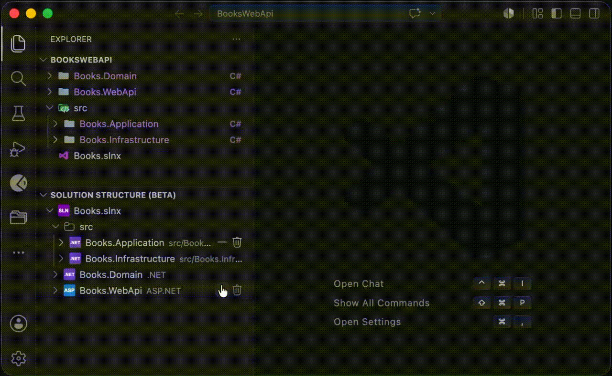
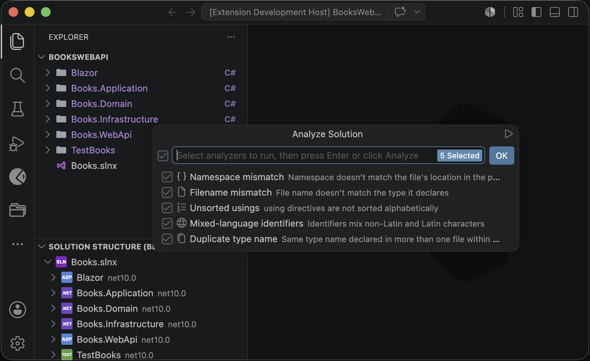
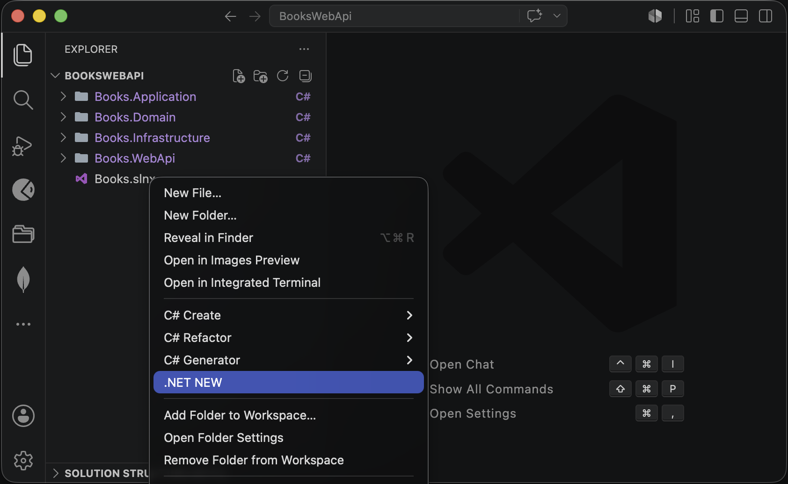
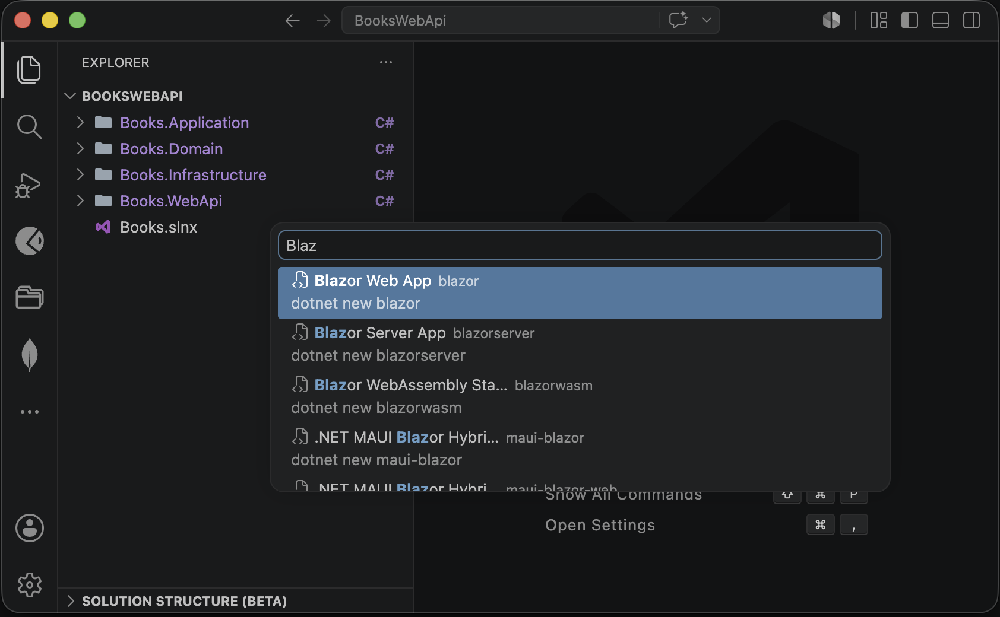
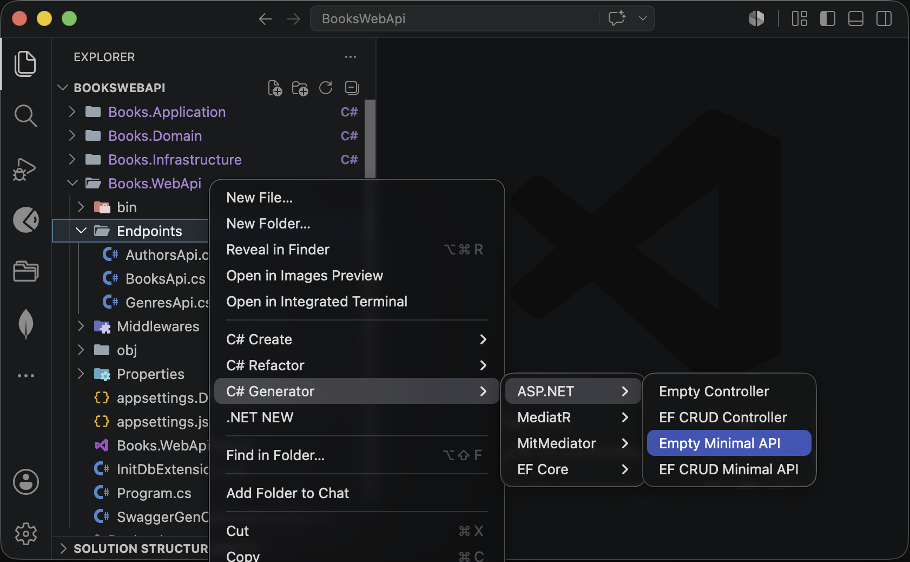
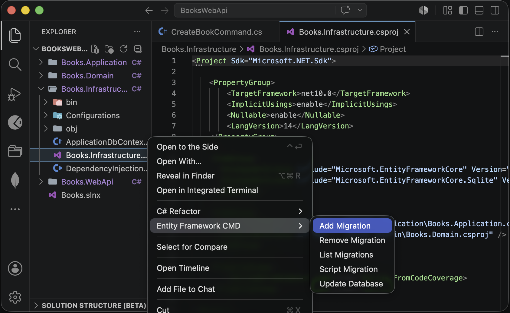
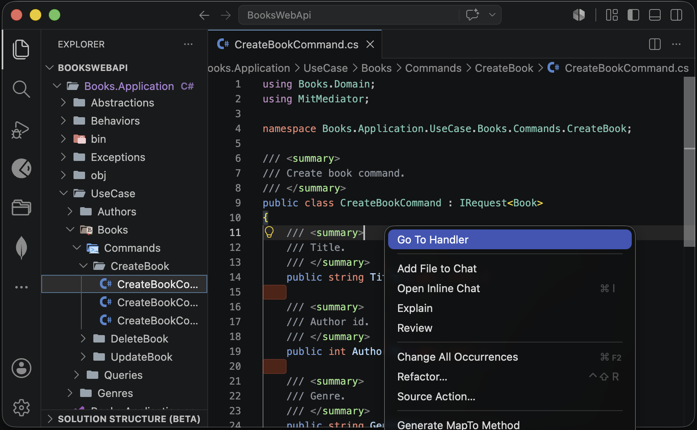

C# Painkiller

Smart file creation, code generation, project creation, namespace management and more for C#.

[GitHub repository](https://github.com/dzmprt/CSharpPainkiller)

[VisualStudio Marketplace](https://marketplace.visualstudio.com/items?itemName=DzmitryPratsko.csharppainkiller)

---

## Requirements

- **VS Code 1.92.0+**

## Table of Contents

- [Features](#features)
  - [Solution Structure](#solution-structure)
  - [Create C# Types](#create-c-types)
  - [Adjust Namespaces](#adjust-namespaces)
  - [Rename File By Type](#rename-file-by-type)
  - [Sync Type and File Name](#sync-type-and-file-name)
  - [Diagnostics and Analyze Solution](#diagnostics-and-analyze-solution)
  - [Generate Mapping Methods](#generate-mapping-methods)
  - [Generate DTO](#generate-dto)
  - [Generate FluentValidation Validator](#generate-fluentvalidation-validator)
  - [Extract Type to File](#extract-type-to-file)
  - [Sort Usings](#sort-usings)
  - [Extract Interface](#extract-interface)
  - [.NET Project Creation](#net-project-creation)
  - [ASP.NET Templates](#aspnet-templates)
  - [MediatR and MitMediator templates](#mediatr-and-mitmediator-templates)
  - [EF Core Configuration](#ef-core-configuration)
  - [Entity Framework CMD](#ef-core-cmd)
  - [Go To Handler](#go-to-handler)
  - [Color for projects](#color-for-projects)
  - [Settings](#settings)
- [Issues](#issues)
- [Release Notes](#release-notes)

## Features

### Solution Structure

Explore and manage your `.sln` / `.slnx` solution from the **Solution Structure (beta)** panel in the Explorer sidebar.

- Create/delete solution folders and projects, manage project references
- Add/remove NuGet packages — search across `nuget.config` sources with pre-release toggle and version picker
- Check for NuGet package updates, update one outdated package, or update all outdated packages in a project
- See installed package dependencies and known vulnerable packages when NuGet metadata is available
- Central package management for `Directory.Packages.props`. Migrate all versioned `PackageReference` entries under a solution to `Directory.Packages.props` from the solution root folder or `.sln` / `.slnx` context menu

> Hide with the `csharppainkiller.solutionStructure.show` setting. Disable automatic NuGet version/dependency/vulnerability checks with `csharppainkiller.solutionStructure.autoCheckPackages`; manual checks remain available from the Solution Structure context menu.

### Create C# Types

Quickly scaffold new C# type files with auto-detected namespaces. Right-click a **folder** in the Explorer → **C# Create**.

### Adjust Namespaces

Fix namespace declarations across one file or an entire folder in a single action. Right-click any `.cs` file or folder → **C# Refactor → C# Adjust Namespaces**.

### Rename File By Type

Rename `.cs` files to match the C# type they contain. Right-click a file or folder → **C# Refactor → C# Rename File By Type**.

### Sync Type and File Name

When you change the `.cs` file name, the name of the object in the file changes and vice versa.

Supported type kinds: `class`, `record`, `struct`, `record struct`.

> Can be disabled via the `csharppainkiller.syncTypeAndFileName` setting.

### Diagnostics and Analyze Solution

C# Painkiller reports diagnostics for open `.cs` files and provides **C# Analyze Solution** for a one-off workspace scan with selectable analyzers.

Available analyzers:

- Namespace mismatch
- File name mismatch
- Unsorted `using` directives
- Mixed-language identifiers
- Duplicate type names within the same project

Open-files diagnostics are controlled by the `csharppainkiller.diagnostics.*` settings. The **C# Analyze Solution** command lets you choose analyzers for that run without changing your saved settings.

### Generate Mapping Methods

Generate static `MapTo{TargetType}` / `MapFrom{TargetType}` methods for mapping between types

The extension prompts for the target type, maps matching public properties, and inserts the method at the end of the source type.

### Generate DTO

Scaffold a DTO class with matching public properties and a static `MapFrom{SourceType}` factory method inside the DTO.

### Generate FluentValidation Validator

Generate a FluentValidation `AbstractValidator<T>` for a class, record, or struct based on its public properties. Rules are inferred from property types (strings, numbers, dates, enums, collections, and more).

### Extract Type to File

Move an extra type from a multi-type file into its own `{TypeName}.cs` file. The quick fix appears on extractable type names when the current file contains more than one type and the selected type is not already the file's primary type.

### Sort Usings

Sort and deduplicate top-level `using` directives in a `.cs` file or across an entire folder. Right-click → **C# Refactor → C# Sort Usings**.

Sort order: global usings, `System.*` namespaces, other namespaces, static usings, then alias usings. The unsorted-usings diagnostic uses the same order.

### Extract Interface

Generate an interface from a class definition in one click. Right-click a `.cs` file → **C# Refactor → C# Extract Interface**.

### .NET Project Creation

Scaffold new .NET projects using dynamic templates from `dotnet new list`. The extension dynamically fetches available .NET templates and registers them as commands at startup, allowing you to create any project type supported by the .NET SDK.

### ASP.NET Templates

Scaffold ASP.NET controllers and Minimal API endpoints. Right-click a folder → **C# Generator → ASP.NET**.

### MediatR and MitMediator templates

Generate requests, handlers, notifications, and pipeline behaviors. Right-click a folder → **C# Generator → MediatR/MitMediator**. It is not necessary to enter the full name of the request, if it is a base request like "get, create, delete, update or other" the extension will automatically substitute the name and determine whether it is a command or a query.

### EF Core Configuration

Scaffold Entity Framework Core entity configurations. Right-click a folder → **C# Generator → EF Core**, or right-click a `.cs` entity file directly.

### Entity Framework CMD

Run Entity Framework Core migration commands directly from the Explorer context menu on a `.csproj` file:

### Go To Handler

Navigate between a MediatR/MitMediator request or notification file and its handler. Right-click a mediator `.cs` file in the Explorer:

- **Go To Handler** — open the matching handler file
- **Generate Handler** — create a handler if one does not exist yet

Code actions in the editor offer the same navigation when the cursor is on a request or notification type.

### Color for projects

The names of the folders containing project files are highlighted in purple.

### Settings

Use VS Code settings (`Ctrl+,` / `Cmd+,`) to control which feature groups are visible in context menus and code actions:

| Setting | Default | Description |
|---------|---------|-------------|
| `csharppainkiller.templates.showMediatR` | `true` | Show MediatR generator commands |
| `csharppainkiller.templates.showMitMediator` | `true` | Show MitMediator generator commands |
| `csharppainkiller.templates.showAspNet` | `true` | Show ASP.NET generator commands |
| `csharppainkiller.templates.showEfCore` | `true` | Show EF Core configuration commands |
| `csharppainkiller.templates.showFluentValidation` | `true` | Show FluentValidation commands |
| `csharppainkiller.solutionStructure.show` | `true` | Show the Solution Structure panel in the Explorer sidebar |
| `csharppainkiller.solutionStructure.autoCheckPackages` | `true` | Automatically check NuGet package versions, dependencies, and known vulnerabilities when Solution Structure initializes |
| `csharppainkiller.syncTypeAndFileName` | `true` | Automatically rename the `.cs` file when the single type inside it is renamed (on save), and rename the type when the file is renamed |
| `csharppainkiller.diagnostics.wrongNamespace` | `true` | Warn when a file's namespace does not match its project path |
| `csharppainkiller.diagnostics.wrongFilename` | `true` | Warn when a file name does not match its declared type name |
| `csharppainkiller.diagnostics.unsortedUsings` | `false` | Warn when top-level `using` directives are not in C# Painkiller sort order |
| `csharppainkiller.diagnostics.mixedLanguageIdentifiers` | `false` | Warn when identifiers mix Latin and non-Latin characters |
| `csharppainkiller.diagnosticDebounceDelay` | `1000` | Delay in milliseconds before re-analyzing an open `.cs` file after edits |

## Issues

- If you find a bug please report it on [GitHub issues](https://github.com/dzmprt/CSharpPainkiller/issues)

## Release Notes

See [CHANGELOG.md](CHANGELOG.md) for the full version history.
